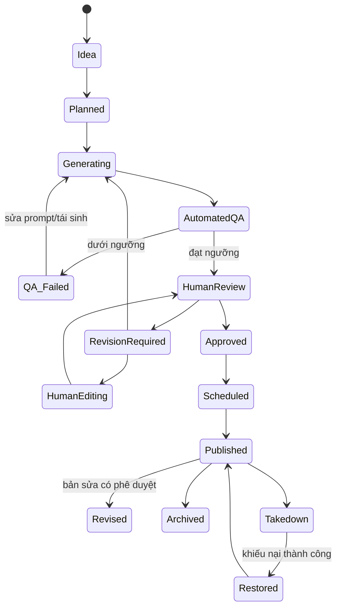
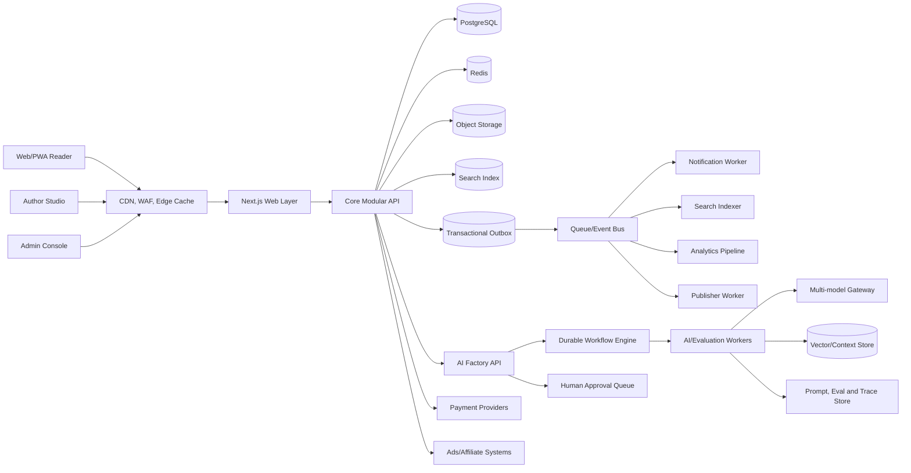
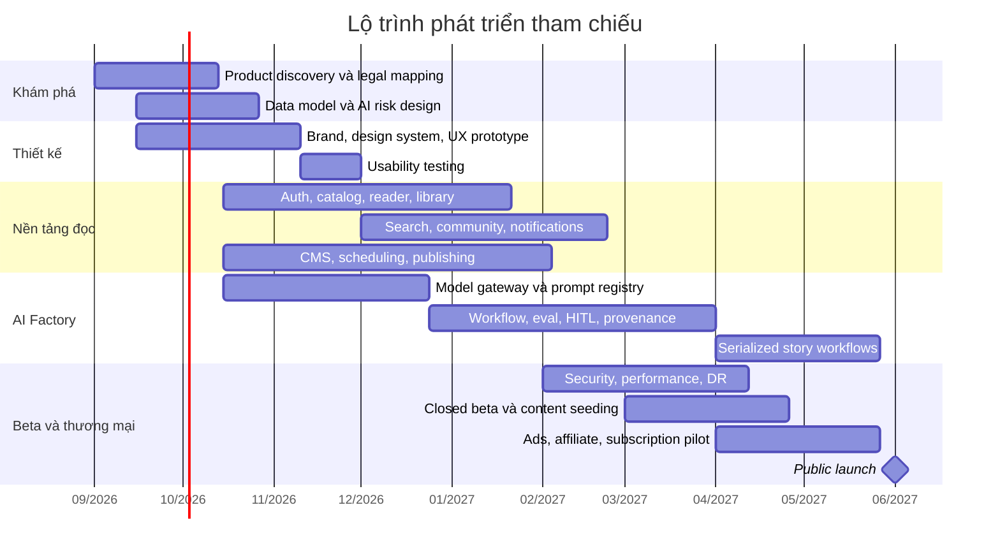

# Báo cáo nghiên cứu và tài liệu nghiệp vụ cho nền tảng đọc truyện vận hành bằng AI Factory

## Tóm tắt điều hành

Ý tưởng nên được phát triển thành **hai sản phẩm có ranh giới rõ ràng nhưng dùng chung hạ tầng**:

1. **Nền tảng đọc truyện hướng người dùng**: thư viện truyện nhiều thể loại, trải nghiệm đọc cao cấp, tài khoản, cá nhân hóa, cộng đồng, tìm kiếm, thanh toán, quảng cáo và affiliate.
2. **AI Factory hướng vận hành nội bộ và B2B**: nền tảng điều phối mô hình, dữ liệu, prompt, workflow, đánh giá, phê duyệt, lịch chạy và giám sát; có thể phục vụ không chỉ ứng dụng truyện mà còn các ứng dụng tạo nội dung, marketing, giáo dục hoặc truyền thông sau này.

Các nền tảng như WEBTOON, Tapas và Royal Road cho thấy những năng lực cốt lõi của một hệ sinh thái truyện số gồm công cụ xuất bản, lịch phát hành, phân tích, kiểm duyệt bình luận, cộng đồng và nhiều phương thức kiếm tiền. WEBTOON CANVAS cung cấp tài nguyên về lên lịch tập, analytics và moderation; Tapas kết hợp doanh thu quảng cáo với đóng góp từ người hâm mộ; Royal Road kết hợp web novel, cộng đồng, quảng cáo và affiliate. Tuy nhiên, lợi thế cạnh tranh của dự án này không nên là “sinh được thật nhiều truyện”, mà là **vận hành được một danh mục IP truyện có chất lượng, nhất quán, minh bạch về nguồn gốc và có khả năng giữ chân độc giả**. citeturn14view0turn17view0turn17view1turn17view2

Khuyến nghị kiến trúc giai đoạn đầu là **modular monolith cho sản phẩm đọc truyện**, kết hợp một **dịch vụ AI Factory độc lập** chạy bằng worker, queue và workflow engine. Không nên triển khai toàn bộ dưới dạng microservices ngay từ đầu vì chi phí vận hành, quan sát hệ thống và xử lý giao dịch phân tán sẽ vượt quá lợi ích ở quy mô MVP.

AI không được phép tự động xuất bản không kiểm soát ngay khi ra mắt. Mọi truyện nên đi qua “cổng chất lượng” gồm kiểm tra cấu trúc, tính nhất quán, nội dung bị cấm, tương đồng với tác phẩm có sẵn, metadata, quyền sử dụng tài sản và phê duyệt của biên tập viên. NIST xác định các nhóm rủi ro quan trọng của AI tạo sinh gồm confabulation, quyền riêng tư, sở hữu trí tuệ, tính toàn vẹn thông tin, nội dung độc hại, thiên kiến và rủi ro chuỗi cung ứng; đồng thời khuyến nghị lưu dấu nguồn gốc, đánh giá với ground truth, giám sát con người và kiểm thử đối kháng trong toàn vòng đời. citeturn14view2turn15view0

**Giả định lập kế hoạch**

| Hạng mục | Giả định cơ sở |
|---|---|
| Thị trường đầu tiên | Việt Nam, nội dung tiếng Việt |
| Định dạng ban đầu | Truyện chữ dài kỳ; ảnh bìa và minh họa là tài sản bổ trợ |
| Thiết bị | Responsive web/PWA, ưu tiên mobile; chưa làm native app trong MVP |
| Quy mô beta | 5.000–20.000 người dùng đăng ký |
| Quy mô sau năm đầu | 30.000–100.000 MAU tùy ngân sách tăng trưởng |
| Sản lượng nội dung | Khoảng 500–1.500 chương mới mỗi tháng sau khi ổn định |
| Mô hình nội dung | AI, human và hybrid; tất cả đều được gắn nhãn rõ ràng |
| Vận hành AI | Multi-model, không phụ thuộc cứng vào một nhà cung cấp |
| Mức tự động hóa | Human-in-the-loop bắt buộc ở giai đoạn đầu |
| Pháp lý | Cần luật sư Việt Nam xác nhận trước khi production; báo cáo không phải tư vấn pháp lý |

**Quyết định sản phẩm quan trọng**

| Quyết định | Khuyến nghị |
|---|---|
| North-star metric | Tổng giờ đọc có tương tác mỗi tuần hoặc số độc giả quay lại đọc hằng tuần |
| Lợi thế cạnh tranh | Thế giới truyện có chiều sâu, lịch phát hành đều, UX đọc xuất sắc, cá nhân hóa và minh bạch AI |
| Nội dung MVP | 4–6 thể loại trọng tâm, 20–40 series được kiểm soát chất lượng |
| Kiến trúc | Modular monolith + AI Factory độc lập + event/queue |
| Xuất bản tự động | Chưa bật mặc định; chỉ mở theo workflow, thể loại và mức rủi ro |
| Kiếm tiền ban đầu | Affiliate phù hợp ngữ cảnh, quảng cáo nhẹ, gói không quảng cáo |
| Kiếm tiền giai đoạn sau | Subscription, mở khóa sớm, coin/microtransaction, tài trợ series |
| Tác giả AI | Là persona thương hiệu, không giả mạo con người thật |
| SEO | Chất lượng và tính nguyên bản trước số lượng; không mass-publish để thao túng tìm kiếm |
| Phạm vi AI Factory | Nền tảng multi-tenant, template-driven, API-first và có audit đầy đủ |

## Mô hình nghiệp vụ và phạm vi sản phẩm

**Mục tiêu nghiệp vụ**

Nền tảng phải đồng thời tối ưu bốn vòng lặp:

- **Vòng lặp độc giả**: khám phá → bắt đầu đọc → đọc tiếp → theo dõi → nhận thông báo → quay lại.
- **Vòng lặp nội dung**: ý tưởng → sản xuất → đánh giá → biên tập → xuất bản → đo phản hồi → cải thiện.
- **Vòng lặp doanh thu**: lưu lượng và mức độ gắn bó → quảng cáo, affiliate hoặc giao dịch → tái đầu tư vào nội dung.
- **Vòng lặp dữ liệu**: hành vi độc giả và phản hồi biên tập → dataset đánh giá → cải thiện workflow và cá nhân hóa.

### Các bên liên quan và persona

| Persona | Mục tiêu | Nhu cầu chính | Nỗi đau/rủi ro | Quyền chính |
|---|---|---|---|---|
| Độc giả khách | Tìm và đọc nhanh | Trang tải nhanh, đọc thử không cần đăng nhập, tìm kiếm, thể loại | Pop-up, quảng cáo dày, truyện chất lượng thấp | Đọc nội dung công khai, tìm kiếm, chia sẻ |
| Độc giả thành viên | Theo dõi nhiều series | Đồng bộ tiến độ, thư viện, bookmark, thông báo, lịch sử, đề xuất | Mất tiến độ, đề xuất lặp lại, spam thông báo | Quản lý hồ sơ, thư viện, bình luận, thanh toán |
| Độc giả trả phí | Trải nghiệm cao cấp | Không quảng cáo, mở khóa sớm, quyền lợi thành viên | Paywall khó hiểu, coin không minh bạch | Mua gói, mua chương, quản lý hóa đơn |
| Tác giả con người | Sáng tác và xây khán giả | Studio, bản nháp, AI hỗ trợ, analytics, doanh thu, quyền tác giả | AI thay đổi giọng văn, tranh chấp quyền, quy trình phê duyệt chậm | Tạo/sửa nội dung được giao, gửi duyệt |
| Tác giả hybrid | Đồng sáng tác với AI | Story bible, kiểm soát prompt, diff, phê duyệt từng phần | Mất tính nhất quán, không truy xuất được nguồn | Chạy workflow được cấp phép, sửa và duyệt |
| Persona tác giả AI | Đại diện cho một dòng nội dung | Hồ sơ công khai, phong cách, lịch phát hành, disclosure | Bị hiểu nhầm là người thật, phong cách trùng tác giả khác | Không đăng nhập; được quản lý như thực thể nội dung |
| Biên tập viên | Đảm bảo chất lượng | Review queue, diff, comments, rubric, story bible | Quá tải review, thiếu ngữ cảnh, lỗi lặp | Chỉnh sửa, trả lại, phê duyệt, yêu cầu tái sinh |
| Moderator | Bảo vệ cộng đồng và thương hiệu | Report queue, rule engine, bằng chứng, lịch sử vi phạm | Quyết định không nhất quán, nội dung nhạy cảm | Ẩn, khóa, cảnh cáo, chuyển cấp |
| Content operations | Duy trì lịch xuất bản | Calendar, inventory, SLA, tự động hóa, cảnh báo | Trễ lịch, workflow treo, thiếu chương dự phòng | Schedule, pause/resume, reassign |
| Admin sản phẩm | Điều hành toàn hệ thống | Dashboard, feature flags, taxonomy, quyền, audit | Thay đổi nhầm production, lạm quyền | Quản trị cấu hình có kiểm soát |
| Đối tác affiliate | Tạo doanh thu giao dịch | Link/deep link, attribution, báo cáo click/conversion | Link hỏng, gian lận click, sai disclosure | Quản lý chiến dịch được cấp |
| Nhà quảng cáo | Tiếp cận đúng độc giả | Targeting theo ngữ cảnh, brand safety, frequency cap | Nội dung nhạy cảm, số liệu không tin cậy | Xem campaign/report, không truy cập PII |
| Chủ sở hữu/quản lý | Tăng trưởng và lợi nhuận | Unit economics, cohort, chất lượng nội dung, rủi ro | Chi phí AI tăng, retention thấp, tranh chấp IP | Báo cáo tổng hợp, phê duyệt chính sách |

### Hành trình người dùng chủ đạo

| Hành trình | Luồng đề xuất | Tiêu chí thành công |
|---|---|---|
| Độc giả mới | Landing → chọn 3 thể loại → đọc thử → lưu tiến độ → đăng ký nhẹ → theo dõi series | Đọc được trong dưới 3 thao tác; không ép đăng nhập trước khi có giá trị |
| Độc giả quay lại | Deep link/thông báo → chương mới → tự động về đúng vị trí → phản ứng/bình luận → chương tiếp | Khôi phục chính xác vị trí đọc; không mất cài đặt |
| Khám phá truyện | Trang chủ → recommendation rail → filter → trang series → đọc chương đầu | Bộ lọc rõ; giải thích ngắn “Vì sao được đề xuất” |
| Mua quyền lợi | Gặp chương mở khóa sớm → xem giá và quyền lợi → chọn phương thức → thanh toán → đọc ngay | Idempotent; không trừ tiền hai lần; quyền truy cập cấp gần thời gian thực |
| Tác giả human/hybrid | Tạo dự án → story bible → chọn workflow → tạo outline/draft → diff/review → gửi biên tập | Mọi thay đổi truy vết được; người dùng luôn có quyền từ chối output AI |
| Biên tập viên | Review queue → xem score/cảnh báo → so sánh phiên bản → sửa hoặc trả lại → phê duyệt | Không cần mở nhiều hệ thống; có đầy đủ prompt/model/source lineage |
| Content ops | Calendar → kiểm tra tồn kho → schedule → theo dõi run → xử lý lỗi → xuất bản | Biết trước nguy cơ trễ; auto-pause khi chất lượng dưới ngưỡng |
| Moderator | Nhận report → xem nội dung và lịch sử → áp policy → hành động → thông báo/appeal | Có SLA, lý do chuẩn hóa và audit không thể sửa âm thầm |

### Phạm vi chức năng

| Miền chức năng | Yêu cầu bắt buộc | Giai đoạn |
|---|---|---|
| Authentication | Email/password hoặc magic link; social login; xác minh email; quên mật khẩu; quản lý phiên; MFA cho nhân sự đặc quyền | MVP |
| Hồ sơ độc giả | Avatar, tên hiển thị, ngôn ngữ, thể loại yêu thích, cài đặt riêng tư, thông báo | MVP |
| Thư viện cá nhân | Theo dõi, yêu thích, lịch sử, đọc tiếp, bookmark, danh sách tùy chỉnh | MVP |
| Reader | Tiến độ đọc, dark/sepia, font, cỡ chữ, line height, chiều rộng, khóa màn hình thức, phím tắt | MVP |
| Discover | Trang chủ, thể loại, tag, bảng xếp hạng, series mới, hoàn thành, lịch phát hành | MVP |
| Search | Title, author, nhân vật, tag, synopsis; typo tolerance; filter/facet; autocomplete | MVP/Scale |
| Series và chương | Trang series, danh sách chương, trạng thái, lịch, rating, cảnh báo nội dung, disclosure AI | MVP |
| Community | Reaction, bình luận, report, spoiler tag, moderation | Beta |
| Author Studio | Project, story bible, editor, version, workflow run, review comments, analytics | MVP |
| Editorial CMS | Queue, rubric, diff, assignment, approval, schedule, takedown | MVP |
| AI Factory | Orchestration, template, dataset, eval, HITL, automation, API, monitoring | MVP |
| Monetization | Ad slots, affiliate blocks, subscription, entitlement, payment ledger | Beta |
| Partner portal | Campaign, placement, tracking, báo cáo, invoice/export | Scale |
| Localization | Locale, bản dịch, phiên bản theo thị trường, glossary | Beta/Scale |
| Experimentation | Feature flags, A/B test, recommendation experiment | Beta |
| Audit và compliance | Audit trail, consent, retention, export/delete request, rights ledger | MVP |

Authentication nên cho phép **anonymous session nâng cấp thành tài khoản** mà không mất lịch sử đọc. Tài khoản nhân sự phải tách khỏi độc giả, áp dụng RBAC/ABAC, MFA bắt buộc, session ngắn hơn và step-up authentication cho thao tác như xóa nội dung, thay đổi thanh toán hoặc bật auto-publish. Supabase Auth là một lựa chọn khả thi cho MVP vì tích hợp JWT với PostgreSQL Row Level Security; Auth0 hoặc Clerk phù hợp hơn khi cần enterprise federation, passkey và quản trị danh tính nâng cao. citeturn16view6turn7search0turn7search8turn7search2

### Cá nhân hóa

Cá nhân hóa nên tiến hóa theo ba tầng:

| Tầng | Cơ chế | Dữ liệu sử dụng | Guardrail |
|---|---|---|---|
| Khởi động | Onboarding chọn thể loại, độ dài, mood | Lựa chọn trực tiếp | Có nút bỏ qua |
| Hành vi | Collaborative/content-based ranking | View, start, completion, follow, dwell time, bỏ truyện | Không dùng thuộc tính nhạy cảm |
| Ngữ cảnh | Thời điểm, thiết bị, chương mới, lịch đọc | Session context và lịch phát hành | Frequency cap, nút “không quan tâm” |

Recommendation score có thể bắt đầu bằng công thức dễ giải thích:

`score = affinity_thể_loại + affinity_tác_giả + độ_mới + độ_phổ_biến_theo_cohort + xác_suất_hoàn_thành − repetition_penalty − fatigue_penalty`

Không nên tối ưu đơn thuần theo click. Một tựa có thumbnail hấp dẫn nhưng độc giả rời sau vài đoạn phải bị giảm hạng. Các tín hiệu tốt hơn gồm tỷ lệ bắt đầu sang hoàn thành chương, số chương mỗi session, follow sau chương đầu, quay lại trong bảy ngày và tỷ lệ bỏ series.

### Nội dung, thể loại và taxonomy

**Loại nội dung**

- Series dài kỳ, truyện hoàn chỉnh, truyện ngắn, anthology và spin-off.
- Chương chính, ngoại truyện, recap, giới thiệu nhân vật và phụ lục thế giới.
- Ảnh bìa, thumbnail, minh họa; audiobook và motion content để sau.
- Editorial collection, bảng xếp hạng, danh sách theo mood và chiến dịch theo mùa.
- Nội dung thương mại: affiliate block, sponsored collection, branded story; phải tách metadata và hiển thị disclosure.

**Thể loại ban đầu đề xuất:** fantasy, romance, mystery/thriller, horror, science fiction và slice of life. Subgenre có thể gồm urban fantasy, progression fantasy, LitRPG, cultivation, time travel, historical romance, psychological thriller, cozy mystery và young adult. Không nên mở quá nhiều thể loại ngay từ đầu; mỗi thể loại cần đủ series và lịch phát hành để tạo cảm giác “thư viện sống”.

**Metadata tối thiểu**

| Nhóm | Trường dữ liệu |
|---|---|
| Danh tính | `series_id`, slug, title, alternate title, locale |
| Sáng tạo | author entity, contributor, AI/human/hybrid disclosure, publisher |
| Phân loại | primary genre, secondary genres, tags, mood, trope, audience |
| An toàn | age rating, content warnings, explicitness, moderation status |
| Xuất bản | status, release cadence, scheduled time, first/last published |
| Cấu trúc | volume, arc, chapter number, canonical order, estimated reading time |
| Thương mại | free/paid, entitlement type, price, campaign eligibility |
| Quyền | rights owner, license basis, territory, expiry, source asset records |
| AI lineage | workflow run, prompt version, model profile, dataset references, reviewer |
| SEO | canonical URL, title, description, structured-data fields, indexability |
| Chất lượng | editorial score, consistency score, similarity score, policy score |

Taxonomy nên là mô hình có quản trị thay vì chuỗi tag tự do hoàn toàn. `Genre`, `Subgenre`, `Trope`, `Mood`, `Theme`, `Audience`, `AgeRating` và `ContentWarning` phải là các dimension riêng; synonym chỉ phục vụ tìm kiếm. Ví dụ, “enemies to lovers” là trope, không phải genre; “u tối” là mood; “18+” là age rating.

### Vòng đời nội dung



Mỗi lần xuất bản phải tạo một **published snapshot bất biến**. Sửa lỗi sau xuất bản tạo revision mới, giữ lại bản cũ trong kho nội bộ và ghi rõ ai sửa, sửa gì, lý do, ticket liên quan và thời điểm. Thao tác takedown không xóa vật lý ngay; hệ thống chuyển trạng thái, chặn phân phối, loại khỏi search/CDN, giữ bằng chứng theo retention policy và cho phép phục hồi có kiểm soát.

### Mô hình doanh thu

| Mô hình | Cách triển khai | Ưu điểm | Rủi ro/guardrail |
|---|---|---|---|
| Quảng cáo hiển thị | Banner/native slot tại home, series và cuối chương | Dễ triển khai, phù hợp free traffic | Không chèn giữa đoạn; giới hạn mật độ và tần suất |
| Quảng cáo trực tiếp | Tài trợ collection, genre, release event | CPM tốt hơn, kiểm soát thương hiệu | Tách rõ sponsored; duyệt creative |
| Affiliate | Sách, đồ sưu tầm, khóa học, giải trí hoặc sản phẩm phù hợp nội dung | Không cần paywall | Disclosure, chống click fraud, không ép click |
| Subscription | Không quảng cáo, quyền đọc sớm, theme, badge | Doanh thu định kỳ | Cần thư viện đủ mạnh và churn control |
| Microtransaction | Coin/mở khóa sớm/chương premium | Monetize fan sâu | Ledger kép, minh bạch giá, refund |
| Support/tip | Ủng hộ series hoặc tác giả human | Gắn kết cộng đồng | Quy định chia sẻ doanh thu, thuế |
| Licensing | Bán quyền chuyển thể, dịch, audio, xuất bản | Biên lợi nhuận cao nếu IP thành công | Rights ledger và hợp đồng chặt chẽ |
| B2B AI Factory | Thu phí workspace, workflow run, API hoặc managed service | Tái sử dụng nền tảng | Chỉ nên mở sau khi nội bộ đã ổn định |

Tapas đã chứng minh sự kết hợp giữa doanh thu quảng cáo và fan support; Royal Road công khai sử dụng affiliate; WEBTOON vận hành nhiều cơ chế kiếm tiền cho creator. Đây là bằng chứng rằng mô hình lai phù hợp hơn việc phụ thuộc vào một nguồn thu duy nhất. citeturn17view1turn17view2turn0search3

Ở Việt Nam, MoMo và VNPAY là các lựa chọn cần đưa vào vòng đánh giá thanh toán; VNPAY công bố cổng hỗ trợ thẻ, QR, app-to-app và nhiều kênh ngân hàng. ACCESSTRADE có thể được đánh giá cho affiliate nội địa. Khả năng onboarding, phí, recurring payment, settlement, hoàn tiền và điều khoản ngành nội dung phải được xác nhận trực tiếp ở thời điểm ký hợp đồng. citeturn16view7turn16view8turn16view9

## AI Factory và workflow tái sử dụng

AI Factory không nên là một tập script chuyên “viết truyện”. Nó phải là **control plane cho các quy trình AI có trạng thái**, có thể dùng lại cho nhiều ứng dụng và nhiều tenant.

### Mô hình miền trừu tượng

| Thực thể | Vai trò |
|---|---|
| `Workspace` | Đơn vị tổ chức hoặc tenant |
| `Application` | Ứng dụng tiêu thụ AI Factory: story, marketing, localization… |
| `Project` | Một mục tiêu dài hạn, ví dụ một series |
| `WorkflowTemplate` | Định nghĩa versioned của các bước |
| `WorkflowRun` | Một lần thực thi với trạng thái và lịch sử |
| `Artifact` | Outline, chapter, cover brief, translation, report… |
| `PromptTemplate` | Prompt có schema, biến đầu vào, version và owner |
| `ModelProfile` | Model/provider, tham số, giới hạn, routing policy |
| `Dataset` | Dữ liệu huấn luyện, reference, evaluation hoặc blacklist |
| `EvaluationSuite` | Tập rubric, grader, threshold và test case |
| `PolicyPack` | Quy tắc nội dung, quyền, thương hiệu và thị trường |
| `ApprovalTask` | Nhiệm vụ human-in-the-loop |
| `Schedule` | Cron/event/calendar và quy tắc bù lỗi |
| `Connector` | CMS, storage, payment, search, notification, external API |
| `AuditEvent` | Bản ghi bất biến của thay đổi và hành động |

### Thành phần nền tảng

| Thành phần | Trách nhiệm | Yêu cầu thiết kế |
|---|---|---|
| Model gateway | Gọi nhiều LLM/image model qua interface chung | Routing theo chất lượng, giá, latency, locale; fallback có kiểm soát |
| Prompt registry | Lưu, version, test, approve prompt | Immutable version; semantic diff; owner; rollback |
| Workflow engine | Điều phối bước dài, retry, wait, human approval | Durable execution, idempotency, timeout, compensation |
| Dataset registry | Quản lý corpus và evaluation set | Lineage, license, checksum, access policy, retention |
| Retrieval/context | Truy xuất story bible, chương cũ, glossary | Citation nội bộ, token budgeting, chống context poisoning |
| Generation services | Ideation, outline, prose, summary, metadata | Structured output; schema validation |
| Evaluation engine | Automated grader và human rubric | Baseline, regression test, score calibration |
| Moderation/policy | Nội dung cấm, tuổi, toxicity, brand safety | Rule + model + human escalation |
| Similarity/IP check | Phát hiện trùng lặp hoặc bắt chước quá sát | N-gram, embedding, reference corpus, manual review |
| Provenance ledger | Lưu nguồn, model, prompt, dataset, thao tác con người | Append-only, queryable, exportable |
| Human review UI | Diff, comment, accept/reject, regenerate vùng chọn | Không che prompt/model; hỗ trợ lý do quyết định |
| Scheduler | Calendar, dependency, inventory buffer | Timezone-aware, pause, blackout, catch-up policy |
| API/event layer | Kết nối các app | Versioned API, webhook signature, event schema registry |
| Monitoring | Chất lượng, chi phí, latency, lỗi, drift | Theo model/workflow/tenant/version |
| Budget controller | Quota, cost ceiling, concurrency | Hard limit và soft alert |
| Secrets/access | Provider keys, service accounts, permissions | Vault/KMS, rotation, least privilege |

LLM có tính không xác định và hành vi có thể thay đổi theo model snapshot, do đó prompt phải được xem như code: version, test và promotion qua môi trường. Hướng dẫn chính thức của OpenAI mô tả một vòng lặp gồm thiết lập eval, prompt với ngữ cảnh phù hợp, đánh giá trên dữ liệu đại diện và liên tục cải thiện. Nền tảng không nên mặc định rằng fine-tuning luôn là giải pháp; retrieval, prompt, schema và evaluation thường phải được làm tốt trước. citeturn14view1

Đối với tác vụ không cần kết quả tức thời như đánh giá hàng loạt, tạo embedding, phân loại kho chương hoặc sinh tồn kho nội dung ban đêm, nên có adapter hỗ trợ batch API. OpenAI hiện mô tả Batch API là xử lý bất đồng bộ với chi phí thấp hơn 50% so với endpoint đồng bộ, rate limit riêng và thời gian hoàn thành tối đa 24 giờ; đây là một lựa chọn, không phải cam kết rằng mọi nhà cung cấp đều có đặc tính tương tự. citeturn18view7

Workflow dài cần durable execution thay vì cron gọi script rời rạc. Temporal có thể tiếp tục workflow từ lịch sử khi worker hoặc hạ tầng gặp sự cố, phù hợp cho chuỗi sinh nội dung kéo dài nhiều giờ hoặc chờ người phê duyệt nhiều ngày. Dù sử dụng Temporal hay giải pháp khác, từng activity vẫn phải idempotent vì retry có thể xảy ra. citeturn16view2turn8search18

### Workflow tạo truyện chuẩn

| Bước | Input | Output | Trigger | Vai trò | Failure mode | Xử lý |
|---|---|---|---|---|---|---|
| Brief | Genre, audience, mục tiêu series, policy | Creative brief | Tạo project/campaign | Producer, editor | Brief mâu thuẫn hoặc quá chung | Form validation; trả lại owner |
| Ideation | Brief, trend nội bộ, catalog gap | 5–20 premise có score | Manual hoặc lịch quý | AI + editor | Ý tưởng sáo rỗng, giống IP có sẵn | Novelty/similarity check |
| Selection | Premise, rubric thương mại | Premise được chọn | Approval task | Editor/owner | Không premise nào đạt | Tái sinh với constraint mới |
| Story bible | Premise, genre template | World, cast, rules, timeline | Sau selection | AI + editor | Logic thế giới thiếu nhất quán | Constraint graph; review |
| Outline | Story bible, độ dài | Arc và chapter outline | Approved bible | AI | Pacing kém, thiếu payoff | Structural grader; revise |
| Draft | Outline, context các chương | Chapter draft | Theo lịch/inventory | AI | Context overflow, mất giọng | Context compression; fallback |
| Consistency QA | Draft, bible, prior chapters | Issues + score | Tự động sau draft | AI evaluator | False positive/negative | Multi-grader + human sampling |
| Policy/IP QA | Draft, policy, corpus | Risk flags | Tự động | Policy service | Không xác định được quyền | Block và chuyển legal/editor |
| Copy edit | Draft và issue list | Edited revision | QA đạt | AI/human editor | AI làm đổi nội dung cốt lõi | Semantic diff; giới hạn edit |
| Human approval | Draft, diff, scores | Approved/rejected | Approval task | Editor | Review quá hạn | Escalate/reassign |
| Packaging | Nội dung, metadata, cover brief | Publish package | Approved | CMS worker | Thiếu metadata/tài sản | Schema block |
| Scheduling | Package, calendar | Release reservation | Auto/manual | Content ops | Trùng slot, thiếu inventory | Calendar constraint |
| Publishing | Snapshot, entitlement, index config | Public chapter | Đến giờ | Publisher service | Partial publish | Transactional outbox, rollback |
| Post-publish | Events, comments, quality signals | KPI và feedback set | Theo cửa sổ 24h/7d | Analytics/editor | Bot traffic làm nhiễu | Fraud filtering, cohort analysis |

### Workflow truyện dài kỳ tự động theo lịch

| Thành phần | Input/trigger | Output | Chủ sở hữu | Failure mode | Chính sách phục hồi |
|---|---|---|---|---|---|
| Release planner | Cadence, số chương tồn kho, ngày cấm | Calendar 8–12 tuần | Content ops | Lịch vượt năng lực | Giảm cadence; cảnh báo |
| Inventory monitor | Số chương đã duyệt | Days-of-inventory | Automation | Dưới ngưỡng an toàn | Tạm campaign; tạo task ưu tiên |
| Rolling outline | Feedback và arc hiện tại | Outline cập nhật | Lead editor | AI bẻ cốt truyện theo comment nhất thời | Chỉ dùng feedback tổng hợp |
| Chapter factory | Schedule − lead time | Draft mới | Workflow engine | Model lỗi/rate limit | Retry/fallback; giữ buffer |
| Editorial queue | Draft đạt automated QA | Approval task | Editor | Queue backlog | SLA routing; giới hạn WIP |
| Auto-schedule | Approval + slot | Scheduled chapter | Content ops policy | Chương sai thứ tự | Dependency/sequence lock |
| Publish | Due time | Public snapshot | Platform | CDN/search không đồng bộ | Outbox và reconciliation |
| Performance review | Sau 1, 7, 28 ngày | Cohort report | Product/editor | Tối ưu quá sớm | Minimum sample threshold |
| Season checkpoint | Kết thúc arc | Continue/pause/finish | Editorial board | Sunk-cost bias | Rubric chiến lược định trước |

Ngưỡng đề xuất là luôn có **tồn kho 3–6 chương đã duyệt** cho mỗi series trọng điểm. Khi inventory xuống dưới ngưỡng, hệ thống không được “bù” bằng cách bỏ qua kiểm duyệt; thay vào đó phải giảm cadence, trì hoãn hoặc kích hoạt đội biên tập dự phòng.

### Workflow đồng sáng tác human–AI

| Bước | Người điều khiển | AI được phép làm | AI không được tự làm | Output |
|---|---|---|---|---|
| Xác lập ý đồ | Tác giả | Gợi ý câu hỏi, premise, cấu trúc | Quyết định chủ đề cuối cùng | Author intent |
| Story bible | Tác giả + editor | Chuẩn hóa nhân vật, timeline, luật thế giới | Thay đổi canon đã khóa | Versioned bible |
| Viết cảnh | Tác giả | Brainstorm, viết biến thể, mở rộng mô tả | Ghi đè bản tác giả | Candidate passages |
| Chỉnh sửa | Tác giả | Grammar, pacing suggestions, continuity flags | Đồng nhất hóa giọng văn ngoài ý muốn | Revision + diff |
| Phản biện | Editor | Rubric và issue detection | Phê duyệt thay con người | Review report |
| Quyết định | Tác giả/editor | Giải thích trade-off | Tự chấp thuận | Approved manuscript |
| Công bố | CMS | Tạo metadata, summary, teaser | Gắn nhãn sai nguồn gốc | Publish package |

Studio phải cung cấp ba chế độ: **suggest**, **apply with diff** và **regenerate selection**. Không nên cho phép AI sửa âm thầm toàn chương. Mỗi đề xuất cần hiển thị phạm vi thay đổi, lý do, model, prompt version và mức confidence nếu có.

### Workflow localization và adaptation

| Bước | Input | Output | Trigger | Vai trò | Lỗi thường gặp |
|---|---|---|---|---|---|
| Locale brief | Source, thị trường, audience | Localization policy | Mở locale mới | Localization lead | Không xác định mức chuyển ngữ |
| Glossary extraction | Story bible, names, terms | Termbase | Tự động | AI + linguist | Tên/đại từ không nhất quán |
| Translation draft | Chương, glossary | Bản dịch | Source approved | AI | Dịch literal, mất giọng |
| Cultural QA | Draft, market policy | Risk notes | Sau dịch | Reviewer địa phương | Thành ngữ hoặc nội dung không phù hợp |
| Literary edit | Draft và notes | Localized version | QA đạt | Human editor | Làm lệch canon |
| Cross-version check | Source revision | Sync report | Source thay đổi | Automation | Bản dịch không được cập nhật |
| Publish | Locale package | Localized page | Approval | CMS | Canonical/hreflang sai |

### Đánh giá chất lượng và giảm hallucination

Một chương không nên có một “điểm AI” duy nhất. Cần scorecard đa chiều:

| Dimension | Phương pháp |
|---|---|
| Canon consistency | So khớp story bible, timeline, quan hệ, trạng thái nhân vật |
| Continuity | So với N chương gần nhất và recap dài hạn |
| Plot coherence | Rubric về causal chain, setup/payoff, conflict |
| Character voice | Classifier/embedding kết hợp human reference |
| Style quality | Repetition, sentence diversity, clarity, pacing |
| Safety | Policy classifier, rules, human escalation |
| Originality | Exact match, n-gram, semantic similarity, web/corpus review hợp pháp |
| Metadata accuracy | Schema validation và cross-check |
| Reader value | Blind human rating và tín hiệu hoàn thành thực tế |
| Business suitability | Audience, length, cadence, monetization compatibility |

Các biện pháp giảm sai lệch gồm story bible có schema, retrieval theo scene, summary phân tầng, timeline graph, output có cấu trúc, constraint checker, generation–critique tách model hoặc tách prompt, kiểm tra xác suất không đủ chắc chắn và yêu cầu con người xử lý các mâu thuẫn quan trọng. NIST khuyến nghị dataset chất lượng cao, nhiều phương pháp đánh giá, fact-checking khi cần, ghi nhận lineage và kết nối với hệ thống quản lý nội dung/version control. citeturn14view2turn15view0

**Fine-tuning** chỉ nên được xem xét khi đã có dataset được cấp quyền, tiêu chí ổn định và đủ ví dụ tốt/xấu. Use case phù hợp hơn là phân loại metadata, giọng văn thương hiệu được sở hữu hợp pháp hoặc format chuyên biệt; không được fine-tune để bắt chước một tác giả sống hoặc phong cách nhận diện quá sát nếu không có quyền rõ ràng.

### Attribution, giải thích và nguồn gốc

Mỗi artifact phải trả lời được:

- Do workflow template/version nào tạo?
- Prompt version và model profile nào được dùng?
- Dataset/context nào đã được truy xuất?
- Ai đã chỉnh sửa, phê duyệt hoặc từ chối?
- Automated grader nào đã chạy và đạt ngưỡng nào?
- Tài sản nguồn có license gì?
- Phiên bản nào hiện đang được xuất bản?

Nên dùng **provenance ledger nội bộ** cho văn bản. C2PA/Content Credentials có thể được dùng cho ảnh bìa, minh họa, audio và media có tooling tương thích vì tiêu chuẩn này được thiết kế để biểu đạt nguồn gốc và lịch sử chỉnh sửa của nội dung số; nhưng không nên xem C2PA là sự thay thế hoàn toàn cho lineage chi tiết của chapter text. citeturn16view4

Quan sát AI nên ghi trace cho từng bước, nhưng phải redact dữ liệu cá nhân và nội dung bí mật. MLflow hiện hỗ trợ tracing input, output, metadata, human feedback, evaluation và chỉ số như latency/token usage, đồng thời tương thích OpenTelemetry; đây là một ứng viên tốt cho lớp quan sát AI không phụ thuộc chặt vào model vendor. citeturn16view3

## Kiến trúc kỹ thuật và lựa chọn nền tảng

### So sánh các lựa chọn kiến trúc

| Lựa chọn | Ưu điểm | Nhược điểm | Phù hợp |
|---|---|---|---|
| Monolith truyền thống | Phát triển nhanh, deployment đơn giản | Coupling cao, khó tách worker và scale riêng | Prototype nhỏ |
| Modular monolith | Giao dịch đơn giản, codebase thống nhất, ranh giới module rõ | Cần kỷ luật kiến trúc | **Khuyến nghị cho reader/CMS MVP** |
| Microservices | Scale và release độc lập, ranh giới tổ chức | Distributed transaction, observability, DevOps tốn kém | Khi nhiều squad và tải lớn |
| Serverless-heavy | Ít vận hành, scale theo tải | Cold start, lock-in, khó cho workflow dài | API nhỏ, image jobs, webhook |
| Cloud-managed | Nhanh, backup/security baseline tốt | Chi phí tăng theo quy mô, lock-in | **Khuyến nghị giai đoạn đầu** |
| Self-hosted | Kiểm soát dữ liệu và chi phí lớn hạn | Cần SRE mạnh, patch/backup 24/7 | Khi có yêu cầu đặc biệt hoặc tải ổn định |
| Hybrid | Managed DB/storage, self-host AI/worker | Cân bằng kiểm soát và tốc độ | Giai đoạn tăng trưởng |

**Khuyến nghị:** Reader API, CMS, identity mapping, catalog, entitlement và billing logic nằm trong modular monolith. AI Factory, workflow workers, search indexer, recommendation jobs, media processing và notification workers là deployment riêng, giao tiếp bằng API và event.



### Stack khuyến nghị

| Lớp | Khuyến nghị chính | Phương án thay thế | Lý do |
|---|---|---|---|
| Frontend | Next.js + TypeScript + React | Nuxt/Vue, SvelteKit | SSR/SSG, SEO, streaming, hệ sinh thái |
| UI system | Tailwind CSS + Radix UI hoặc headless components | MUI, Chakra | Kiểm soát thẩm mỹ cao, accessible primitives |
| Reader typography | CSS variable font + design tokens | Native fonts | Tối ưu rendering và tùy biến |
| Backend core | NestJS/TypeScript hoặc FastAPI/Python | Go/.NET | NestJS đồng bộ TypeScript; FastAPI gần AI ecosystem |
| AI workers | Python + Pydantic | TypeScript workers | Hệ sinh thái ML/evaluation tốt |
| Database | PostgreSQL managed | MySQL | Transaction, JSONB, full-text, extension ecosystem |
| Cache/session | Redis managed | Valkey | Cache, rate limit, distributed lock |
| Object storage | S3-compatible/R2 | GCS/Azure Blob | Ảnh, export, artifact, backup |
| Search MVP | PostgreSQL FTS | — | Giảm thành phần hệ thống |
| Search scale | Meilisearch/Typesense/OpenSearch | Algolia | Typo tolerance, facet, autocomplete |
| Workflow | Temporal Cloud/self-host | AWS Step Functions, GCP Workflows, Celery | Workflow dài, retry, human wait |
| Messaging | Cloud queue/SQS/Pub/Sub | Kafka/Redpanda | Managed queue trước; Kafka khi event volume lớn |
| Analytics | GA4 + warehouse; PostHog cho product analytics | Amplitude/Mixpanel | Acquisition + funnel/replay/feature flags |
| Observability | OpenTelemetry + Sentry + metrics/log backend | Datadog/New Relic | Portable telemetry |
| AI observability | MLflow hoặc vendor-neutral equivalent | Langfuse, platform vendor tools | Trace, eval, feedback, prompt versions |
| CDN/WAF | Cloudflare | CloudFront/Fastly | CDN, WAF, image optimization |
| CI/CD | GitHub Actions/GitLab CI | Cloud-native pipeline | Dễ tự động hóa |
| Infrastructure | Terraform/OpenTofu | Pulumi | Infrastructure as code |
| Secrets | Cloud secret manager/KMS | Vault | Rotation, audit, least privilege |

PostgreSQL phù hợp làm nguồn dữ liệu chính vì hỗ trợ transaction, relational constraint và JSONB; tài liệu chính thức mô tả GIN index để tìm kiếm hiệu quả trong số lượng lớn tài liệu JSONB. Chỉ nên dùng JSONB cho metadata mở rộng, không biến toàn bộ data model thành document store. citeturn17view5

Meilisearch hoặc Typesense nên được bổ sung khi search cần typo tolerance, prefix matching, facets, synonym và tuning relevance ở quy mô lớn. Meilisearch công bố các chức năng typo tolerance, prefix search và ranking đa tiêu chí; tuy nhiên dữ liệu gốc vẫn phải ở PostgreSQL và index phải có khả năng xây lại hoàn toàn. citeturn17view6

Cloudflare hoặc CDN tương đương nên cache cover, font, JavaScript, public chapter snapshots và metadata ít thay đổi; các trang cá nhân hóa, entitlement và admin không được cache chung. Cloudflare cung cấp CDN cache, image transformation, WAF và web performance analytics; lựa chọn cuối cùng phải được benchmark từ Việt Nam và các thị trường dự kiến. citeturn17view4

### Mẫu lưu trữ dữ liệu

| Dữ liệu | Kho chính | Mẫu thiết kế |
|---|---|---|
| User/account mapping | PostgreSQL | Tách identity provider ID và profile nội bộ |
| Series/chapter metadata | PostgreSQL | Normalized core + JSONB extension |
| Chapter body | PostgreSQL hoặc object store có version | Snapshot hash; signed access cho bản nháp |
| Published HTML/JSON | Object store + CDN | Immutable theo version |
| Media | Object storage | Original + derivatives; checksum và license |
| Reading progress | PostgreSQL/Redis write buffer | Upsert idempotent; đồng bộ async |
| Events | Queue → warehouse/lake | Append-only; schema version |
| Search documents | Search engine | Derived index, có thể rebuild |
| Vector embeddings | pgvector/vector DB | Namespace theo workspace/project |
| Prompt/eval artifacts | AI metadata DB + object store | Immutable version và lineage |
| Payments | PostgreSQL ledger | Double-entry-like ledger; không dựa vào webhook đơn lẻ |
| Audit | Append-only store | WORM/retention nếu cần |
| Logs/traces | Observability backend | Redaction trước ingest |

Một payment transaction phải tách các trạng thái `created`, `pending_provider`, `authorized`, `captured`, `failed`, `refunded`, `chargeback`. Webhook phải xác minh chữ ký, xử lý idempotent và có reconciliation định kỳ với provider. Entitlement chỉ được cấp sau trạng thái thành công phù hợp, nhưng UI cần xử lý trường hợp provider phản hồi chậm.

### Cache, queue và consistency

**Cache layers**

- Browser cache cho font, JS, CSS và ảnh versioned.
- CDN cache cho public series/chapter snapshots.
- Server cache cho catalog, taxonomy, ranking và feature configuration.
- Redis cho session phụ trợ, rate limit, hot metadata và short-lived recommendation.
- Không cache dài đối với quyền truy cập trả phí hoặc dữ liệu admin.

**Event patterns**

- Transactional outbox khi publish, thanh toán, entitlement hoặc takedown.
- Idempotency key cho generation run, payment, publish và notification.
- Dead-letter queue cho lỗi không thể retry.
- Backoff có jitter cho lỗi provider.
- Sequence number cho chapter ordering.
- Reconciliation jobs để phát hiện DB, CDN, search và analytics lệch trạng thái.

### Dịch vụ bên thứ ba cần đánh giá

| Năng lực | Shortlist | Tiêu chí lựa chọn |
|---|---|---|
| Auth | Supabase Auth, Auth0, Clerk | Social login Việt Nam, MFA, passkey, SLA, exportability |
| Payment Việt Nam | MoMo, VNPAY, đối tác ngân hàng/PSP khác | Recurring, QR, refund, settlement, phí, onboarding |
| Payment quốc tế | Stripe hoặc merchant-of-record phù hợp | Khả năng cung cấp dịch vụ tại pháp nhân, thuế, subscription |
| Ads | Google AdSense/Ad Manager, direct campaigns | Publisher eligibility, brand safety, fill rate |
| Affiliate | ACCESSTRADE và chương trình trực tiếp | Product fit, deep link, conversion API, fraud control |
| Email | AWS SES, Postmark, SendGrid | Deliverability, domain reputation, webhook |
| Push | Web Push, Firebase Cloud Messaging | Trình duyệt hỗ trợ, segmentation |
| Analytics | GA4, PostHog | Consent, event governance, replay redaction |
| Error monitoring | Sentry | Frontend/backend traces, source maps, PII control |
| AI providers | Ít nhất hai provider hoặc một gateway abstraction | Tiếng Việt, chất lượng dài hạn, giá, data policy |
| Moderation | Provider model + custom policy + human | Locale, explainability, false positive |
| Search | Meilisearch/Typesense/OpenSearch/Algolia | Tiếng Việt, tokenizer, typo, cost |
| CDN/security | Cloudflare hoặc cloud-native edge | Latency Việt Nam, WAF, DDoS, purge |

GA4 có event model cho hành vi thương mại như xem sản phẩm, checkout, purchase và refund; các event tương tự có thể được ánh xạ sang subscription, coin package và chapter unlock. PostHog cung cấp product analytics, session replay, feature flag và experiment trong một nền tảng, nhưng replay phải che nội dung draft, dữ liệu thanh toán và dữ liệu cá nhân. citeturn17view8turn17view9

## Trải nghiệm, quản trị, tuân thủ và vận hành

### Định hướng UI/UX “siêu đẹp”

“Siêu đẹp” không nên được hiểu là nhiều animation hoặc hình nền nặng. Đối với nền tảng đọc, vẻ đẹp đến từ **typography, khoảng trắng, nhịp thị giác, chuyển cảnh tinh tế, ảnh bìa nhất quán và khả năng cá nhân hóa mà không làm người đọc phân tâm**.

**Ngôn ngữ thiết kế đề xuất**

- Editorial-cinematic: typography như tạp chí kết hợp card art đậm chất điện ảnh.
- Một font display cho tiêu đề và một font reading tối ưu tiếng Việt.
- Design token cho màu, spacing, radius, shadow, motion và typography.
- Light, dark và sepia theme; tất cả kiểm tra contrast.
- Animation 150–250 ms cho tương tác; tôn trọng `prefers-reduced-motion`.
- Skeleton chỉ dùng khi có ích; tránh layout shift.
- Ảnh bìa theo art direction nhất quán, không dùng hình AI chất lượng thấp hàng loạt.

**Wireframe trang chủ**

```text
┌─────────────────────────────────────────────────────────┐
│ Logo   Khám phá   Thể loại   Lịch phát hành   Search  Me│
├─────────────────────────────────────────────────────────┤
│ CINEMATIC HERO                                          │
│ [Artwork]  Tên truyện / hook / badge / CTA Đọc ngay     │
├─────────────────────────────────────────────────────────┤
│ Đọc tiếp                                                │
│ [Card + progress] [Card + progress] [Card + progress]    │
├─────────────────────────────────────────────────────────┤
│ Dành cho bạn              Vì bạn thích Fantasy          │
│ [Series cards, reason chips, hide action]                │
├─────────────────────────────────────────────────────────┤
│ Biên tập viên tuyển chọn | Mới cập nhật | Sắp hoàn thành │
├─────────────────────────────────────────────────────────┤
│ Genre mosaic / Editorial collection / Affiliate block   │
└─────────────────────────────────────────────────────────┘
```

**Wireframe trang series**

```text
┌─────────────────────────────────────────────────────────┐
│ Cover │ Title, author, AI/Human/Hybrid badge             │
│       │ Genres, warnings, status, release schedule       │
│       │ [Đọc từ đầu] [Đọc tiếp] [Theo dõi]               │
├─────────────────────────────────────────────────────────┤
│ Synopsis / expandable story information                 │
│ “Cách tác phẩm được tạo” / contributor disclosure       │
├─────────────────────────────────────────────────────────┤
│ Chapter list: free/paid, date, length, read state        │
├─────────────────────────────────────────────────────────┤
│ Similar series / reviews / community                    │
└─────────────────────────────────────────────────────────┘
```

**Wireframe reader**

```text
┌─────────────────────────────────────────────────────────┐
│ ← Series     Chương 12     43%      Aa  Theme  Bookmark  │
├─────────────────────────────────────────────────────────┤
│                                                         │
│        Cột đọc 620–760px, line-height tùy chỉnh          │
│        Không quảng cáo xen giữa các đoạn văn             │
│                                                         │
├─────────────────────────────────────────────────────────┤
│ [Previous]   reaction/comment   [Next chapter]           │
│ Native ad hoặc affiliate block chỉ tại ranh giới tự nhiên│
└─────────────────────────────────────────────────────────┘
```

**Wireframe Author Studio**

```text
┌──────────────┬──────────────────────────┬────────────────┐
│ Project tree │ Editor / version diff    │ AI Assistant   │
│ Bible        │ Draft                    │ Context used   │
│ Characters   │ Inline comments          │ Eval scores    │
│ Timeline     │ Accept/reject changes    │ Regenerate     │
├──────────────┴──────────────────────────┴────────────────┤
│ Workflow run timeline | cost | model | reviewer | audit │
└─────────────────────────────────────────────────────────┘
```

**Wireframe Admin Cockpit**

```text
┌─────────────────────────────────────────────────────────┐
│ Pipeline health | Chapters at risk | Review SLA | Cost   │
├────────────────┬───────────────────┬────────────────────┤
│ Release calendar│ Moderation queue  │ Rights warnings    │
├────────────────┼───────────────────┼────────────────────┤
│ Quality trends │ Revenue/retention │ Experiment status  │
└────────────────┴───────────────────┴────────────────────┘
```

### Sitemap

```mermaid
flowchart TD
    HOME[Trang chủ] --> DISCOVER[Khám phá]
    HOME --> SEARCH[Tìm kiếm]
    HOME --> LIBRARY[Thư viện cá nhân]
    HOME --> ACCOUNT[Tài khoản]

    DISCOVER --> GENRES[Thể loại]
    DISCOVER --> RANKING[Bảng xếp hạng]
    DISCOVER --> NEW[Mới cập nhật]
    DISCOVER --> COMPLETE[Đã hoàn thành]
    DISCOVER --> SCHEDULE[Lịch phát hành]
    DISCOVER --> COLLECTIONS[Bộ sưu tập]

    SEARCH --> RESULTS[Kết quả và bộ lọc]
    GENRES --> SERIES[Trang series]
    RESULTS --> SERIES
    SERIES --> READER[Trình đọc]
    SERIES --> AUTHOR[Hồ sơ tác giả]
    READER --> COMMENTS[Bình luận và phản hồi]

    LIBRARY --> CONTINUE[Đọc tiếp]
    LIBRARY --> FOLLOWING[Đang theo dõi]
    LIBRARY --> BOOKMARKS[Bookmark]
    LIBRARY --> HISTORY[Lịch sử]

    ACCOUNT --> PROFILE[Hồ sơ]
    ACCOUNT --> PREFERENCES[Tùy chọn đọc]
    ACCOUNT --> NOTIFICATIONS[Thông báo]
    ACCOUNT --> BILLING[Gói và giao dịch]
    ACCOUNT --> PRIVACY[Quyền riêng tư]

    STUDIO[Author Studio] --> PROJECTS[Dự án]
    PROJECTS --> BIBLE[Story Bible]
    PROJECTS --> EDITOR[Editor]
    PROJECTS --> WORKFLOWS[Workflow Runs]
    PROJECTS --> ANALYTICS[Series Analytics]

    ADMIN[Admin Console] --> CMS[Editorial CMS]
    ADMIN --> CALENDAR[Release Calendar]
    ADMIN --> MODERATION[Moderation]
    ADMIN --> AIADMIN[AI Factory]
    ADMIN --> RIGHTS[Rights & Provenance]
    ADMIN --> REVENUE[Revenue]
    ADMIN --> AUDIT[Audit & Security]

    PARTNER[Partner Portal] --> AFFILIATE[Affiliate Campaigns]
    PARTNER --> ADVERTISER[Advertising Campaigns]
    PARTNER --> REPORTS[Reports]
```



### SEO và discoverability

SEO phải được xây quanh **series và chapter canonical pages**, không phải trang tag mỏng hoặc hàng triệu biến thể filter. Mỗi series cần title, synopsis nguyên bản, author/contributor page, breadcrumbs, Open Graph, XML sitemap, canonical và structured data phù hợp. Google mô tả `Article` structured data là cách cung cấp thêm thông tin về tiêu đề, ảnh, ngày và tác giả; với truyện dài kỳ cần đánh giá kết hợp `Article`, `CreativeWork`, `Book` hoặc subtype Schema.org phù hợp, không gắn markup sai chỉ để có rich result. citeturn17view7turn5search4turn5search28

Nguyên tắc SEO:

- Mỗi chương có URL ổn định, canonical rõ ràng và liên kết previous/next.
- Không index trang tìm kiếm nội bộ, filter vô hạn hoặc bản nháp.
- `hreflang` cho các phiên bản dịch.
- Sitemap tách series, chapter, author và image.
- Tự động cập nhật `lastmod` chỉ khi nội dung thay đổi thực sự.
- Metadata do AI đề xuất nhưng CMS kiểm tra trùng lặp và độ dài.
- Server-render nội dung công khai; không giấu toàn bộ trong client JS.
- Nội dung paywall có structured data đúng và không cloaking.
- Editorial landing phải có giá trị riêng, không chỉ là danh sách link.

Google tuyên bố hệ thống tìm kiếm tập trung vào nội dung nguyên bản, chất lượng cao bất kể cách sản xuất, nhưng cũng có chính sách chống “scaled content abuse”. Vì vậy mass-publish hàng nghìn trang AI ít giá trị có thể gây hại cả SEO lẫn thương hiệu; auto-publish phải bị giới hạn bởi quality gate, catalog strategy và nhu cầu độc giả. citeturn16view0turn16view1

### Analytics và KPI

**Event taxonomy cốt lõi**

`series_impression`, `series_open`, `chapter_start`, `reading_progress`, `chapter_complete`, `next_chapter`, `follow`, `unfollow`, `bookmark`, `search`, `search_result_click`, `recommendation_feedback`, `comment`, `report`, `paywall_view`, `checkout_start`, `purchase`, `refund`, `affiliate_impression`, `affiliate_click`, `ad_impression`, `subscription_cancel`.

Không nên gửi event ở mỗi pixel scroll. Reading progress có thể phát ở các mốc 10%, 25%, 50%, 75%, 90%, hoàn thành và heartbeat giới hạn tần suất.

| Nhóm | KPI |
|---|---|
| Acquisition | Organic visits, CAC, signup conversion, source quality |
| Activation | Tỷ lệ bắt đầu chương đầu, hoàn thành chương đầu, follow trong session đầu |
| Engagement | Weekly engaged reading hours, chapters/session, completion rate |
| Retention | D1/D7/D30 reader retention, series return rate, notification return |
| Content | Read-through theo chương, drop-off point, follow/1.000 starts, editorial score |
| AI quality | Approval-first-pass, regeneration rate, human edit distance, policy failure |
| Operations | Workflow success, review backlog, schedule adherence, days-of-inventory |
| Monetization | ARPMAU, ad RPM, affiliate EPC/conversion, subscriber conversion, churn |
| Reliability | Availability, p95 latency, failed publish, payment discrepancy |
| Trust/safety | Report rate, upheld reports, takedown time, appeal reversal |
| Cost | AI cost/approved chapter, infra cost/1.000 reading hours, margin per cohort |

North-star metric đề xuất là **weekly engaged reading hours từ người dùng hợp lệ**, đi cùng guardrail: D30 retention, report rate, AI cost trên chương được duyệt và ad complaints. Nếu chỉ tối ưu giờ đọc mà không có guardrail, sản phẩm dễ sa vào cliffhanger cưỡng ép, dark pattern hoặc nội dung gây nghiện kém lành mạnh.

### Accessibility, localization và hiệu năng

Mục tiêu accessibility là **WCAG 2.2 AA**. WCAG 2.2 bổ sung các yêu cầu như focus không bị che, kích thước mục tiêu tối thiểu và accessible authentication; các yêu cầu này đặc biệt liên quan đến sticky reader controls, modal thanh toán và đăng nhập. citeturn16view5

Các yêu cầu cụ thể:

- Toàn bộ luồng đọc, đăng nhập và thanh toán dùng được bằng bàn phím.
- Semantic HTML, heading đúng tầng, landmark và skip link.
- Focus state rõ và không bị header/footer che.
- Contrast AA cho mọi theme.
- Alt text cho bìa/minh họa; không lặp mô tả trang trí.
- Tùy chọn giảm animation.
- Reader hỗ trợ zoom 200% và không mất nội dung.
- Không dùng CAPTCHA hình ảnh làm rào cản duy nhất.
- Hỗ trợ screen reader cho chapter navigation và progress.
- Nội dung cảnh báo không chỉ biểu đạt bằng màu.

Localization cần tách UI locale, content locale và market/territory. Tất cả chuỗi UI dùng message catalog; ngày, số, tiền và timezone dùng thư viện quốc tế hóa. Slug không nên là khóa chính; một series có thể có slug khác nhau theo locale nhưng cùng canonical content identity.

Mục tiêu Core Web Vitals tại percentile 75 cho cả mobile và desktop là LCP không quá 2,5 giây, INP không quá 200 ms và CLS không quá 0,1, đúng theo ngưỡng được web.dev công bố. citeturn14view6

### Yêu cầu phi chức năng

| Nhóm | Mục tiêu production |
|---|---|
| Availability reader | 99,9% theo tháng, loại trừ bảo trì thông báo trước |
| Availability admin/AI | 99,5% |
| Reader API | p95 dưới 300 ms với request không cache |
| Edge-cached content | p95 dưới 100 ms ở thị trường mục tiêu |
| Search | p95 dưới 250 ms ở tải bình thường |
| Publish correctness | Không xuất bản thiếu chapter body hoặc sai entitlement |
| Scalability | Scale ngang web/worker; không cần downtime khi tăng worker |
| Accessibility | WCAG 2.2 AA |
| RPO | Tối đa 15 phút cho dữ liệu giao dịch/nội dung |
| RTO | Tối đa 4 giờ cho hệ thống cốt lõi |
| Audit | 100% thao tác đặc quyền và thay đổi publish được ghi |
| Security | OWASP ASVS baseline; threat model cho API và AI |
| Data portability | Export user, series, artifact và workflow metadata |
| Maintainability | Module boundary, contract test, migration rollback |
| Observability | Trace ID xuyên web–API–queue–AI workflow |
| AI reproducibility | Lưu model profile, prompt version, input hash và output hash |

### Moderation, bản quyền và đạo đức

**Các lớp kiểm duyệt**

| Lớp | Đối tượng | Cơ chế |
|---|---|---|
| Trước sinh | Prompt, brief, context | Policy pack, access control, blocklist |
| Sau sinh tự động | Draft, metadata, image | Safety model, rules, similarity, age rating |
| Editorial | Bản thảo | Rubric, context review, rights review |
| Trước publish | Package | Final policy gate, metadata, license check |
| Sau publish | Content và community | User report, sampling, model rescans |
| Khiếu nại | Takedown/moderation decision | Independent reviewer, evidence log |

Nội dung cần cấm hoặc kiểm soát nghiêm gồm xâm hại tình dục trẻ em, tình dục không đồng thuận được mô tả để kích thích, hướng dẫn phạm tội nguy hiểm, kích động thù ghét, doxxing, xâm phạm quyền riêng tư và nội dung vi phạm quyền tác giả. Các thể loại horror, dark romance hoặc crime cần age rating, warning và policy riêng; không nên đánh đồng “chủ đề nhạy cảm” với “nội dung bị cấm”.

Mọi tài sản cần rights record: người cấp quyền, phạm vi, lãnh thổ, thời hạn, mục đích, quyền sửa đổi, quyền dùng cho AI và bằng chứng. Dữ liệu dùng làm reference hoặc fine-tuning không được đưa vào hệ thống chỉ vì “tìm thấy trên Internet”. Khung pháp lý Việt Nam hiện có văn bản hợp nhất Luật Sở hữu trí tuệ và Nghị định 17/2023 hướng dẫn quyền tác giả, quyền liên quan; các điều khoản cụ thể về quyền đối với đầu vào và đầu ra AI phải được luật sư chuyên môn xác nhận. citeturn18view2turn18view3

Tác giả AI phải hiển thị theo cách như: **“Persona sáng tạo do hệ thống AI vận hành, có biên tập viên con người giám sát”**. Không tạo ảnh chân dung giả để khiến người dùng tin đó là một cá nhân có thật; không bịa tiểu sử, giải thưởng, kinh nghiệm sống hoặc lời chứng thực. Với tác phẩm hybrid, trang contributor nên nói rõ vai trò: ý tưởng, sáng tác, biên tập, minh họa, dịch thuật.

### Bảo mật và quyền riêng tư

Tính đến ngày báo cáo, Việt Nam đã ban hành Luật Bảo vệ dữ liệu cá nhân số 91/2025/QH15 có hiệu lực từ ngày 1/1/2026, Luật Trí tuệ nhân tạo số 134/2025/QH15 có hiệu lực từ ngày 1/3/2026 và Luật An ninh mạng số 116/2025/QH15 có hiệu lực từ ngày 1/7/2026. Nền tảng có bán subscription hoặc microtransaction cũng cần rà soát Luật Thương mại điện tử số 122/2025/QH15 và Nghị định 248/2026/NĐ-CP, cùng có hiệu lực từ ngày 1/7/2026. Phạm vi nghĩa vụ cụ thể phụ thuộc pháp nhân, mô hình xử lý dữ liệu, loại nội dung, giao dịch và thị trường nên cần legal gap assessment trước khi ra mắt. citeturn14view3turn14view4turn14view5turn18view0turn18view1

Baseline quyền riêng tư theo hướng “GDPR-like”:

- Data inventory và register mục đích xử lý.
- Thu thập tối thiểu; tách dữ liệu bắt buộc và tùy chọn.
- Consent riêng cho marketing, personalization và cookie không thiết yếu.
- Cho phép truy cập, chỉnh sửa, export và yêu cầu xóa theo policy áp dụng.
- Retention schedule theo loại dữ liệu.
- Hợp đồng xử lý dữ liệu với vendor.
- Đánh giá tác động cho recommendation, profiling và AI training.
- Không tự động đưa bình luận, bản nháp riêng tư hoặc support ticket vào dataset huấn luyện.
- Có chế độ không cá nhân hóa và opt-out marketing.
- Age-gating và quy trình cho người dùng chưa thành niên theo tư vấn pháp lý.

Baseline bảo mật nên dựa trên OWASP ASVS và API Security Top 10. Các rủi ro API liên quan trực tiếp gồm broken object-level authorization, broken authentication, unrestricted resource consumption và access sai chức năng quản trị; AI endpoints còn cần quota chặt vì abuse có thể tạo chi phí lớn. citeturn14view7turn18view5

**Kiểm soát bắt buộc**

- MFA và step-up authentication cho nhân sự đặc quyền.
- RBAC kết hợp scope theo workspace/project.
- RLS hoặc authorization ở service layer cho mọi object.
- Encryption in transit và at rest.
- KMS/secret manager, rotation và không đưa key vào source code.
- WAF, bot protection, rate limit theo IP/user/API key/workspace.
- CSRF, XSS, SQL injection, SSRF và upload validation.
- Signed URL ngắn hạn cho draft/media riêng tư.
- Dependency scanning, SAST, DAST và container scanning.
- Backup bất biến và quyền truy cập tách khỏi production admin.
- Prompt-injection defense cho connector/retrieval.
- Tool allowlist; AI không được gọi publish/delete/payment tool trực tiếp nếu chưa có approval.
- Kill switch cho model, workflow và auto-publish.

### Logging và audit trail

| Bản ghi | Nội dung |
|---|---|
| Security log | Login, MFA, session, permission denial, key rotation |
| Admin audit | Actor, action, target, before/after, reason, IP/device, ticket |
| Content lineage | Prompt/model/dataset, generation, edit, reviewer, approval |
| Publishing audit | Schedule, publish attempt, snapshot hash, CDN/search status |
| Payment audit | Provider event, signature status, ledger entry, entitlement |
| Moderation audit | Report, evidence, policy, decision, appeal, reversal |
| Data privacy audit | Consent, export, deletion, retention job |
| AI trace | Step latency, token/cost, score, error; nội dung được redact theo policy |

Không được log password, token phiên đầy đủ, thông tin thẻ hoặc dữ liệu nhạy cảm không cần thiết. OWASP khuyến nghị bảo vệ tính toàn vẹn log, chuyển log về hệ thống tập trung và không ghi password, session ID hoặc dữ liệu thẻ. citeturn18view6

OpenTelemetry nên được dùng để chuẩn hóa trace, metric và log xuyên qua web, API, queue và worker. Tài liệu OpenTelemetry xác định ba loại signal này là nền tảng quan sát hệ thống và nhấn mạnh SLI phải phản ánh trải nghiệm người dùng chứ không chỉ uptime hạ tầng. citeturn18view4

### Backup, khôi phục và vận hành

| Dữ liệu/hệ thống | Chính sách đề xuất |
|---|---|
| PostgreSQL | PITR, encrypted backup hằng ngày, bản sao khác vùng |
| Object storage | Versioning, lifecycle, replication cho artifact quan trọng |
| Search index | Không coi là backup; rebuild từ source of truth |
| Prompt/workflow config | Version trong DB + export định kỳ |
| Secrets | Backup/escrow theo quy trình KMS, không export plain text |
| Audit | Immutable hoặc quyền xóa bị tách biệt |
| IaC | Git repository và state backup |
| Restore testing | Hằng quý cho full restore; hằng tháng cho sample restore |
| Disaster simulation | Ít nhất hai lần mỗi năm |
| Provider outage | Model fallback, payment reconciliation, degraded reader mode |

**Vai trò vận hành**

| Vai trò | Trách nhiệm |
|---|---|
| Product owner | Roadmap, KPI, trade-off |
| Editor-in-chief | Tiêu chuẩn nội dung và catalog |
| Content operations | Lịch, inventory, workflow SLA |
| Trust & Safety | Policy, moderation, incident |
| ML/AI engineer | Workflow, eval, model routing |
| Platform/backend | API, data, billing, publishing |
| SRE/DevOps | Reliability, deployment, DR |
| Security/privacy | Threat model, access, incident, vendor review |
| Customer support | Account, payment, appeal intake |
| Growth/monetization | SEO, affiliate, ads, subscription |
| Legal counsel | IP, privacy, AI, e-commerce, contract |

**SLA nội bộ đề xuất**

| Sự kiện | Mục tiêu |
|---|---|
| Sự cố reader toàn hệ thống P1 | Phản hồi 15 phút, cập nhật 30 phút |
| Publish thất bại với series trọng điểm | Phản hồi 30 phút |
| Payment captured nhưng chưa có entitlement | Xử lý tự động dưới 10 phút; escalation dưới 1 giờ |
| Report nội dung nghiêm trọng | Triage dưới 1 giờ |
| Khiếu nại bản quyền đầy đủ bằng chứng | Acknowledge trong 1 ngày làm việc |
| Review chương thường | Dưới 2 ngày làm việc |
| Review chương theo lịch gấp | Dưới 8 giờ làm việc |
| Workflow AI treo | Alert sau 15–30 phút tùy bước |
| Data subject request | Theo thời hạn pháp luật được counsel xác nhận |

## Lộ trình, nguồn lực, chi phí và rủi ro

### Các giai đoạn phát triển



Ngày trong biểu đồ là lịch tham chiếu nếu bắt đầu vào tháng 9/2026. Một đội đầy đủ có thể đạt public launch trong khoảng **7–10 tháng**; một đội nhỏ hơn hoặc yêu cầu pháp lý/phạm vi native app cao hơn có thể kéo dài 12–15 tháng.

| Giai đoạn | Thời lượng | Kết quả chính | Gate thoát |
|---|---:|---|---|
| Discovery | 4–6 tuần | BRD, scope, legal map, taxonomy, KPI | Stakeholder sign-off |
| UX và design system | 4–8 tuần | Prototype, tokens, reader usability | Test được với người dùng |
| Core MVP | 12–16 tuần | Auth, catalog, reader, library, CMS | E2E publish/read |
| AI Factory v1 | 12–16 tuần, chạy song song | Gateway, workflow, eval, review, audit | 3 workflow production-like |
| Content seeding | 8–12 tuần | 20–40 series, lịch 8 tuần | Quality/inventory đạt ngưỡng |
| Beta hardening | 8–12 tuần | Security, performance, DR, moderation | Launch checklist |
| Monetization pilot | 6–8 tuần | Ads nhẹ, affiliate, subscription | Ledger/reconciliation đạt |
| Scale | Liên tục | Recommendation, localization, B2B | Theo KPI và tải |

### Nguồn lực

**Đội sản phẩm và kỹ thuật ở mức cao điểm**

| Vai trò | FTE |
|---|---:|
| Product manager/BA | 1 |
| Product designer/design system | 1–1,5 |
| Frontend engineer | 2 |
| Backend engineer | 2–3 |
| AI/ML engineer | 2 |
| QA automation/manual | 1–2 |
| DevOps/SRE | 0,5–1 |
| Security/privacy | 0,2–0,5 |
| Data/analytics engineer | 0,5–1 |
| Editor-in-chief/content lead | 1 |
| Biên tập viên/moderator | 2–4 khi beta |
| Growth/SEO/affiliate | 0,5–1 |
| Legal counsel | Theo đợt |

Tổng effort hợp lý cho bản production-ready nằm trong khoảng **65–95 person-months**, chưa bao gồm sản xuất số lượng lớn hình minh họa, native mobile app hoặc marketing trả phí.

### Chi phí ước tính

Đây là **planning estimate**, không phải báo giá. Biến số lớn nhất gồm mức lương đội ngũ, phạm vi nội dung, số workflow, yêu cầu pháp lý, model được chọn và mức độ thuê ngoài.

| Phương án | Phạm vi | Chi phí phát triển ước tính |
|---|---|---:|
| Lean MVP | Reader đẹp, auth, CMS cơ bản, 1–2 workflow AI, human review | 2,5–4,5 tỷ VND |
| Production-ready | Full reader, CMS, AI Factory v1, analytics, payment, security | 4,5–8 tỷ VND |
| Platform-grade | Multi-tenant AI Factory, localization, partner portal, scale/DR nâng cao | 8–15 tỷ VND |

**Chi phí vận hành hằng tháng sau khi ra mắt**

| Hạng mục | Khoảng tham chiếu |
|---|---:|
| Cloud, DB, CDN, storage, observability | 30–120 triệu VND |
| AI inference, embedding và evaluation | 20–200 triệu VND |
| Auth/email/analytics/SaaS | 10–60 triệu VND |
| Biên tập, moderation, content ops | 80–250 triệu VND |
| Support và SRE trực | 30–120 triệu VND |
| Marketing/creator acquisition | Chưa tính |

AI cost nên được quản trị bằng công thức:

`chi phí/chương được duyệt = tổng generation + critique + evaluation + embedding + retry + chi phí review quy đổi / số chương đạt publish gate`

Theo dõi “chi phí mỗi token” là chưa đủ, vì model rẻ nhưng tạo ra nhiều bản phải sửa có thể đắt hơn model tốt. Budget controller phải đặt giới hạn theo workflow, series, workspace và tháng; task không gấp nên chạy batch khi có lợi.

### Ưu tiên backlog

**Must-have trước beta**

- Reader responsive, theme và lưu tiến độ.
- Auth, library, follow, notification cơ bản.
- Catalog, taxonomy, search cơ bản.
- Series/chapter CMS, version, schedule, publish/takedown.
- AI Factory model gateway, prompt version, workflow run, eval, review.
- Rights/provenance, moderation và audit.
- Analytics event chuẩn.
- Backup, restore test, incident process.
- AI/human/hybrid disclosure.

**Nên có trước public launch**

- Recommendation v1.
- Comment/report và moderator console.
- Affiliate placement engine.
- Subscription hoặc gói không quảng cáo.
- Payment reconciliation.
- Editorial collections và SEO tooling.
- Feature flags và A/B testing.
- Cost/quality dashboard cho AI.

**Để sau khi có product–market fit**

- Native mobile app.
- Audiobook/TTS cao cấp.
- Marketplace creator mở hoàn toàn.
- Real-time collaborative editor.
- Semantic conversational search.
- User-generated fan fiction.
- Fine-tuning quy mô lớn.
- B2B self-service AI Factory.
- Chuyển thể comic/video tự động.

### Ma trận rủi ro

| Rủi ro | Xác suất | Tác động | Biện pháp giảm thiểu |
|---|---|---|---|
| Truyện AI chất lượng thấp, lặp mô-típ | Cao | Cao | Catalog nhỏ, rubric, eval regression, human approval |
| Mất nhất quán dài hạn | Cao | Cao | Story bible, timeline graph, hierarchical summaries, continuity gate |
| Sao chép hoặc quá giống tác phẩm khác | Trung–cao | Rất cao | Licensed data, similarity pipeline, rights review, takedown |
| Giả mạo tác giả con người | Trung | Cao | Disclosure bắt buộc, cấm fake biography/testimonial |
| SEO bị coi là scaled content abuse | Cao nếu mass-publish | Cao | Không publish theo volume KPI; unique value và editorial gates |
| Chi phí AI vượt ngân sách | Cao | Cao | Model routing, batch, quota, caching, cost/approved-output KPI |
| Workflow publish trùng hoặc sai thứ tự | Trung | Cao | Durable workflows, idempotency, sequence lock, outbox |
| Provider AI ngừng dịch vụ/thay model | Trung | Cao | Model abstraction, eval suite, fallback, data portability |
| Payment lệch trạng thái | Trung | Cao | Ledger, signed webhook, idempotency, reconciliation |
| Nội dung không phù hợp quảng cáo | Trung | Cao | Brand-safety taxonomy, ad exclusion, manual escalation |
| Quảng cáo phá trải nghiệm đọc | Cao | Cao | Ad-density cap, natural boundaries, subscription no-ads |
| Cá nhân hóa tạo filter bubble | Trung | Trung | Diversity rules, controls, exploration quota |
| Prompt injection từ tài liệu/context | Trung | Cao | Trusted-source separation, sanitization, tool allowlist |
| Rò rỉ draft hoặc dữ liệu cá nhân | Trung | Rất cao | Least privilege, encryption, redaction, DLP, vendor review |
| Lạm quyền admin | Thấp–trung | Rất cao | MFA, dual approval, immutable audit, scoped roles |
| Queue review quá tải | Cao | Cao | WIP limits, sampling theo risk, inventory buffer |
| Lịch phát hành bị đứt | Trung | Cao | 3–6 chương tồn kho, auto-pause, cadence adjustment |
| Tranh chấp doanh thu creator | Trung | Cao | Contract, transparent ledger, payout report, dispute process |
| Phụ thuộc affiliate/ads | Trung | Cao | Đa dạng hóa subscription, licensing, direct sponsorship |
| Nội dung vi phạm pháp luật thị trường mới | Trung | Cao | Locale policy pack, local review, legal sign-off |
| Backup tồn tại nhưng không restore được | Trung | Rất cao | Restore test định kỳ và DR drill |

### Tiêu chí go-live

Không nên public launch cho đến khi đồng thời đạt các điều kiện sau:

| Miền | Điều kiện |
|---|---|
| Nội dung | Ít nhất 20–40 series có chất lượng, mỗi series trọng điểm có tồn kho an toàn |
| Reader | Core Web Vitals đạt mục tiêu trên thiết bị thực tế tại Việt Nam |
| AI | Mọi output publish được truy vết về prompt, model, dataset và reviewer |
| Chất lượng | First-pass approval và regeneration rate ổn định trong tối thiểu bốn tuần |
| Pháp lý | Legal review cho privacy, AI disclosure, IP, payment, commerce và advertising |
| Security | Pen test hoặc assessment độc lập; không còn lỗi critical/high chưa xử lý |
| Payment | Webhook, refund, reconciliation và entitlement đã test end-to-end |
| DR | Khôi phục thành công từ backup trong RTO/RPO |
| Operations | On-call, runbook, moderation SLA và incident communication sẵn sàng |
| Analytics | Event validation, bot filtering, consent và dashboard KPI hoạt động |
| Monetization | Ad/affiliate placement không làm hỏng reader và có disclosure |
| Trust | Takedown, report, appeal và data request được vận hành thử |

Kết luận chiến lược là dự án khả thi, nhưng giá trị không nằm ở việc biến AI thành “máy xuất bản vô hạn”. Sản phẩm nên được định vị là **một studio truyện số có năng lực AI, vận hành theo tiêu chuẩn xuất bản**, trong đó con người kiểm soát canon, chất lượng, quyền và trách nhiệm. AI Factory phải là nền tảng độc lập, có workflow bền vững, đánh giá liên tục, provenance và API rõ ràng; website đọc truyện là ứng dụng đầu tiên chứng minh nền tảng đó tạo được IP hấp dẫn, đều đặn và có unit economics bền vững.